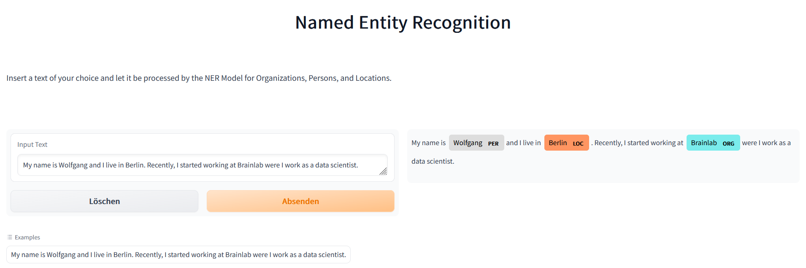

# BERT for Named Entity Recognition

A demonstrator to extract entities of three different categories (Organization, Person, Location) from text.

Find the respective app [here](https://huggingface.co/spaces/cdrc1103/bert_for_ner).
